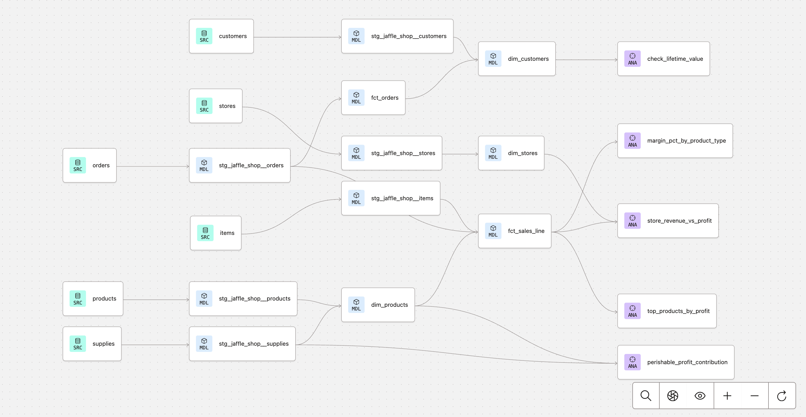

# Jaffle Shop Product Gross Margin Analytics (dbt project)

A dbt project that answers a single business question:

> **During the Philadelphia store's first 16 days, which products and product categories generated the most gross margin contribution, and what actions should the business test next?**

Built on BigQuery using the official 6-table curated Jaffle Shop dataset (customers, orders, items, products, stores, supplies), loaded from the CSVs in `seeds/` via `dbt seed`, so anyone can rebuild it with no external data dependencies. Gross margin contribution is computed per line item and then rolled up by product and product type.

**Scope**: this analysis covers 686 orders and 997 line items from the Philadelphia store between September 1 and September 16, 2016. Gross margin contribution is calculated as selling price minus recorded supply cost, and does not include labor, rent, waste, marketing, or other operating expenses. It is therefore not net profit.

---

## 1. Project Goal

**Primary question**: During the Philadelphia store's first 16 days, which products and product categories generated the most gross margin contribution, and what should the business test next?

**Supporting questions**:
- Which SKUs contributed the most total gross margin?
- How did beverages and jaffles differ in units sold, unit gross margin, and margin percentage?
- Which product category has more of its supply cost tied up in perishable inputs?

**Why it matters**: product mix and purchasing are the two levers a single store can pull in the short term. Knowing which SKUs contribute the most gross margin (not just the most revenue) is what tells the team where menu placement and procurement attention are worth spending.

**Success criteria**: an analytics layer that

1. ranks SKUs by gross margin contribution with concrete dollar amounts,
2. compares the two product categories on volume and unit economics,
3. shows recipe-level perishable cost exposure per category,
4. supports next steps that can be tested with data the shop already collects.

---

## 2. Data Sources

The curated Jaffle Shop dataset ships as 6 CSVs in `seeds/`. Running `dbt seed` loads them into the `<target_schema>_raw_jaffle_shop` dataset in BigQuery:

| Seed file | Loaded as | Rows | Description |
|---|---|---|---|
| `raw_customers.csv` | customers | 128 | One row per customer (id, name) |
| `raw_orders.csv` | orders | 686 | One row per order (id, customer, store_id, ordered_at, subtotal, tax_paid, order_total — all monetary fields in cents) |
| `raw_items.csv` | items | 997 | One row per line item (id, order_id, sku), treated as 1 unit sold |
| `raw_products.csv` | products | 10 | One row per SKU (sku, name, type, price, description) |
| `raw_stores.csv` | stores | 6 | One row per store location (id, name, opened_at, tax_rate) |
| `raw_supplies.csv` | supplies | 65 | One row per supply per SKU (a single SKU can have multiple supplies, e.g. a jaffle needs knife + fork cutlery) |

**Data conventions**:
- `raw_items` has no quantity column, so each row is 1 unit sold
- Revenue per unit = `products.price` (USD, converted from cents via the `cents_to_dollars` macro)
- Cost per unit = sum of `supplies.cost` joined on SKU (a SKU may have multiple supplies)
- Gross margin per unit = revenue per unit − cost per unit
- Data window: 2016-09-01 to 2016-09-16 (16 days), all Philadelphia

---

## 3. DAG / Model Flow

Six sources feed six staging views (one per source), which feed three dimensions and two facts in the marts layer. `fct_sales_line` is the table every analysis queries: it is one row per item sold, carrying revenue, supply cost, and gross margin per unit, with product type and store denormalized in. The five files in `analysis/` sit on top and are compiled and run on demand.



*Lineage graph from the dbt docs viewer — sources on the left (SRC), staging and marts models in the middle (MDL), analyses on the right (ANA).*

---

## 4. Model Descriptions

### Staging layer (1:1 with sources, views)

| Model | Purpose | Grain |
|---|---|---|
| `stg_jaffle_shop__customers` | Rename id→customer_id; pass-through name. | One row per customer |
| `stg_jaffle_shop__orders` | Rename to clear FK names; cast `ordered_at`→date; convert monetary fields cents→USD via `cents_to_dollars`. | One row per order |
| `stg_jaffle_shop__items` | Rename id→order_item_id, sku→product_id. | One row per line item |
| `stg_jaffle_shop__products` | Rename sku→product_id; cents→USD on price; derive `is_food_item`/`is_drink_item` booleans. | One row per SKU |
| `stg_jaffle_shop__stores` | Rename id→store_id; cast opened_at→date. | One row per store |
| `stg_jaffle_shop__supplies` | Surrogate key over (id, sku); cents→USD on cost; rename perishable→is_perishable_supply. | One row per supply per SKU |

### Marts layer (analytical models, tables)

| Model | Purpose | Grain | Key columns |
|---|---|---|---|
| `dim_products` | Product dimension with per-unit economics pre-computed. Sums all supply costs per SKU (a jaffle's knife, fork and filling all roll into one unit_cost). | One row per SKU (10 rows) | product_id (PK), product_price, unit_cost, gross_margin, margin_pct, has_perishable_supply |
| `dim_stores` | Store dimension. Kept in the project so store-level analysis becomes possible once other locations have transactions. | One row per store (6 rows) | store_id (PK), store_name, tax_rate, opened_date |
| `dim_customers` | Customer dimension with lifetime aggregates from fct_orders. | One row per customer (128 rows) | customer_id (PK), customer_name, first_order_date, most_recent_order_date, number_of_orders, lifetime_value |
| `fct_orders` | Order-grain fact table. Pass-through of stg orders with monetary fields in USD. | One row per order (686 rows) | order_id (PK), customer_id, store_id, ordered_at, subtotal, tax_paid, order_total |
| `fct_sales_line` | The central analytics table. Joins items × dim_products × orders and denormalizes product_type / is_food_item / has_perishable_supply for query convenience. Every analysis in this project groups this one table. | One row per line item (997 rows) | order_item_id (PK), order_id, product_id, store_id, customer_id, revenue_per_unit, cost_per_unit, gross_margin_per_unit |

---

## 5. Testing Strategy

The project tests at four levels:

### 5.1 Primary-key generic tests (`unique` + `not_null`)

Primary keys in the staging and marts layers have both `unique` and `not_null` tests. At the source layer, `customers.id` is tested directly. Examples:

```yaml
# in src_jaffle_shop.yml — source layer
- name: customers
  columns:
    - name: id
      data_tests: [unique, not_null]

# in _marts.yml — marts layer
- name: dim_products
  columns:
    - name: product_id
      data_tests: [unique, not_null]
```

This catches the two most common analytics bugs: duplicate fact rows, which inflate metrics, and null keys, which break joins.

### 5.2 Referential integrity (`relationships` tests)

FK columns are tested to point at valid PKs in their dimension:

```yaml
- name: product_id  # in fct_sales_line
  data_tests:
    - relationships:
        arguments:
          to: ref('dim_products')
          field: product_id
```

`fct_sales_line` carries 3 such tests (order_id / product_id / store_id); customer integrity is tested one level up, on `fct_orders.customer_id` → `dim_customers`. If a future CSV reload introduced an unknown SKU, this test would fail before any analysis ran.

### 5.3 Domain rules (singular tests in `tests/`)

A custom SQL test enforces a business rule that can't be expressed as a schema test:

- **`assert_gross_margin_non_negative.sql`** — fails if any product's `gross_margin < 0`. Selling below supply cost is either a pricing bug or an explicitly approved loss leader, so this test forces such cases to be intentional.

### 5.4 Source freshness

Deliberately not configured: the curated dataset is a static snapshot (2016-09-01 to 2016-09-16), so any freshness check would permanently report stale data. In a live system, `orders.ordered_at` would be the `loaded_at_field` to monitor.

### Test count

`dbt build` runs **32 tests** across **11 models** — all passing in the current state.

---

## Insights:

All numbers below come from running `analysis/*.sql` against the live BigQuery target (`capstone` schema). Total gross margin contribution over the 16 days was **$5,412.28** on $6,818 of revenue, and the percentages below are shares of that total.

Note on naming: those queries name their margin columns `total_profit` / `avg_margin`; throughout this README the same quantity is called **gross margin contribution** (selling price − recorded supply cost, as defined at the top).

### Insight 1 — Beverages generated the most gross margin contribution

The top 5 SKUs by gross margin contribution are all beverages, together generating **$3,619.11, or 66.9% of the project total**, while making up 5 of the 10 SKUs. The single largest contributor is **BEV-004 ("for richer or pourover")** at **$1,038.24 (19.2% of the total)** across 168 units sold.

| Rank | SKU | Type | Units | Revenue | Gross margin contribution | % of project total |
|---|---|---|---|---|---|---|
| 1 | BEV-004 | beverage | 168 | $1,176 | $1,038.24 | 19.2% |
| 2 | BEV-001 | beverage | 154 | $924 | $797.72 | 14.7% |
| 3 | BEV-003 | beverage | 160 | $960 | $713.60 | 13.2% |
| 4 | BEV-005 | beverage | 165 | $660 | $556.05 | 10.3% |
| 5 | BEV-002 | beverage | 158 | $790 | $513.50 | 9.5% |
| 6 | JAF-004 | jaffle | 39 | $546 | $412.23 | 7.6% |
| 7 | JAF-001 | jaffle | 37 | $407 | $362.23 | 6.7% |

The jaffle (food) SKUs sell about 4× less often, but each unit sold contributes roughly twice as much gross margin in dollar terms. They are low-volume, high-dollar-margin items rather than volume drivers.

### Insight 2 — Jaffle recipes have more of their supply cost in perishable inputs

Every product has at least one perishable supply, so a boolean flag is uninformative. Computing perishable supply cost ÷ total supply cost per SKU, then averaging across the five SKUs in each category:

| Product type | SKUs | Unweighted average perishable cost share | Range |
|---|---|---|---|
| Jaffle | 5 | 87.2% | 76.0% – 92.1% |
| Beverage | 5 | 68.5% | 52.4% – 82.9% |

In per-SKU terms, an average jaffle carries $2.35 of perishable cost out of $2.64 of total supply cost, while an average beverage carries $0.81 out of $1.11. The most perishable jaffle is **JAF-003 at 92.1%**.

This is recipe-level cost exposure, not observed inventory waste or spoilage: the dataset contains no purchasing, inventory, or waste records.

### Insight 3 — Beverages are the volume engine, jaffles the per-unit margin engine

| Product type | Units sold | Distinct SKUs | Avg price | Avg cost | Unit gross margin | Total gross margin contribution | Margin % |
|---|---|---|---|---|---|---|---|
| Beverage | 805 | 5 | $5.60 | $1.11 | $4.50 | $3,619.11 | 80.3% |
| Jaffle | 192 | 5 | $12.02 | $2.68 | $9.34 | $1,793.17 | 77.7% |

Beverages sold 4.2× as many units and generated the majority of total gross margin, and their margin **percentage** is also slightly higher (80.3% vs 77.7%). Jaffles win on **absolute dollars per unit**: $9.34 versus $4.50, roughly 2× per item sold. So the two categories play different roles, and it is the beverage volume that carries the total.

### Data coverage limitation — only Philadelphia has observed sales

All observed sales came from Philadelphia because the other stores had not opened during the data window. This dataset therefore cannot support a meaningful store-to-store performance comparison, and none is attempted here. The store models are retained to support future multi-store data.

| Store | Opened | Units | Revenue | Status |
|---|---|---|---|---|
| Philadelphia | 2016-09-01 | 997 | $6,818 | Open in the data window |
| Brooklyn | 2017-03-12 | 0 | $0 | Not yet open |
| Chicago | 2018-04-29 | 0 | $0 | Not yet open |
| San Francisco | 2018-05-09 | 0 | $0 | Not yet open |
| New Orleans | 2019-03-10 | 0 | $0 | Not yet open |
| Los Angeles | 2019-09-13 | 0 | $0 | Not yet open |

---

## Next steps:

Each next step maps to one of the insights above, and each is framed as something to test or measure rather than a proven effect.

| # | Action | Rationale (insight) | How to evaluate it |
|---|---|---|---|
| 1 | **Test BEV-004 placement or a controlled promotion** (more prominent menu position, or a time-boxed offer) | BEV-004 alone contributes 19.2% of gross margin (Insight 1) | Compare units sold and gross margin contribution against a baseline period, instead of assuming a fixed lift |
| 2 | **Measure the current beverage-to-jaffle attachment rate using `order_id`, then test a bundle** | Beverages carry the volume; jaffles carry ~2× the dollar margin per unit (Insights 1 and 3) | Establish the baseline attachment rate first, then check whether a bundle raises jaffle attachment without lowering overall margin % |
| 3 | **Add purchasing, inventory and waste data to the warehouse** | Jaffle recipes are 87.2% perishable by cost (Insight 2), but nothing in this dataset shows what actually spoiled | Once waste is recorded, test whether higher perishable exposure turns into real lost margin, and only then size any sourcing change |

### Future work

- **Store-level analysis** — once transactions from additional stores exist, the existing `dim_stores` model and the tested `store_id` keys support store-level gross margin comparisons without remodeling.
- **Time-series view** — the current window is 16 days. Once orders span multiple months, add a date dimension and look at day-of-week and weekly patterns.
- **Customer-cohort overlay** — `dim_customers.lifetime_value` is already computed; crossing it with product mix would show repeat-customer favorites.
- **Incremental refresh** — `fct_sales_line` is a full-refresh table today; with growing volume it should become incremental on `ordered_at`.

---

## How to reproduce

```bash
# 0. Clone and enter the project
git clone https://github.com/CrazyThursV50/dbt-capstone.git
cd dbt-capstone

# 1. Configure ~/.dbt/profiles.yml with a `dbt_capstone` profile pointing at
#    your own BigQuery project (any dataset/schema you can write to):
#
#    dbt_capstone:
#      target: dev
#      outputs:
#        dev:
#          type: bigquery
#          method: service-account   # or oauth
#          keyfile: /path/to/your-service-account.json
#          database: your-gcp-project-id
#          schema: capstone
#          location: US
#          threads: 16
#
#    No access to anyone else's data is needed — all raw data ships in seeds/.

dbt debug          # verify the connection

# 2. Install packages (dbt_utils)
dbt deps

# 3. Load the 6 raw CSVs into <schema>_raw_jaffle_shop
dbt seed

# 4. Build all models + run all tests (11 models, 32 tests)
dbt build

# 5. Write the docs artifacts (this project is built with the dbt Fusion engine)
dbt compile --write-catalog   # produces target/catalog.json + manifest.json
# The lineage graph pictured above comes from these artifacts.

# 6. Re-run any insight on demand
dbt compile --select top_products_by_profit
bq query --nouse_legacy_sql --format=pretty \
  < target/compiled/dbt_capstone/analysis/top_products_by_profit.sql
```

## Data limitations

- Static snapshot of 16 days (2016-09-01 to 2016-09-16) with one open store. Trends and seasonality cannot be inferred from this window.
- All observed sales are from Philadelphia, so store-to-store comparison is out of scope (see the data coverage note above).
- Gross margin contribution is selling price minus recorded supply cost. It excludes labor, rent, utilities, delivery, marketing, and waste, so it is not net profit and should not be read as one.
- Perishable cost share is an unweighted average across the SKUs in each category, computed from recipe supply costs. The dataset has no inventory or waste records, so it measures exposure, not actual spoilage.
- `raw_items` has no quantity column, so each line item is treated as exactly 1 unit.
- Insights describe this sample only; the next steps are framed as experiments and measurements, not causal conclusions.
